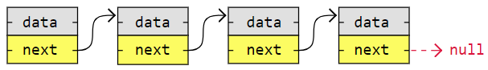
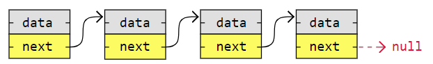
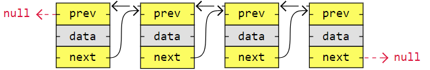
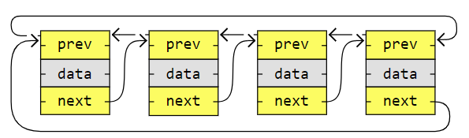

# Practice
My Practice in DSA

### According to Jovian, why should I learn and practice DSA:
- You can think about a problem systematically and solve it systematically step-by-step
- You can envision different inputs, outputs, and edge cases for programs you write
- You can communicate your ideas clearly to co-workes and incorporate their suggestions.
- You can convert your thoughts and ideas into working code that's also readable.

### Method
1. State the problem clearly. Indentify the input & output formats.
2. Come up with some example inputs & outputs. Try to cover all edge cases.
3. Come up with a correct solution for the problem. State it in plain English.
4. Implement the solution and test it using example inputs. Fix bugs, if any.
5. Analyze the algorithm's complexity and identify inefficiencies, if any.
6. Apply the right technique to overcome the inefficiency. Repeat steps 3 to 6.

### Big O Notation
...

## Linked Lists
A linked list consists of nodes with some sort of data, and a pointer, or link, to the next node

There are three basic forms of linked lists:
1. Singly linked lists

2. Doubly linked lists

3. Circular linked lists
